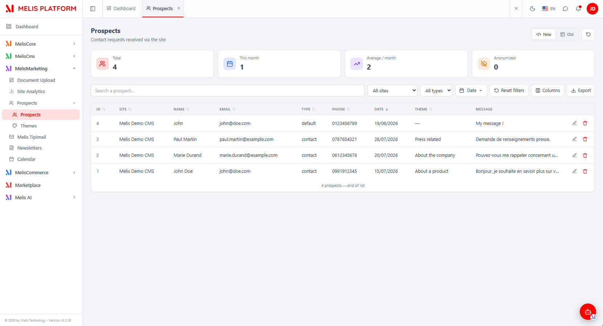
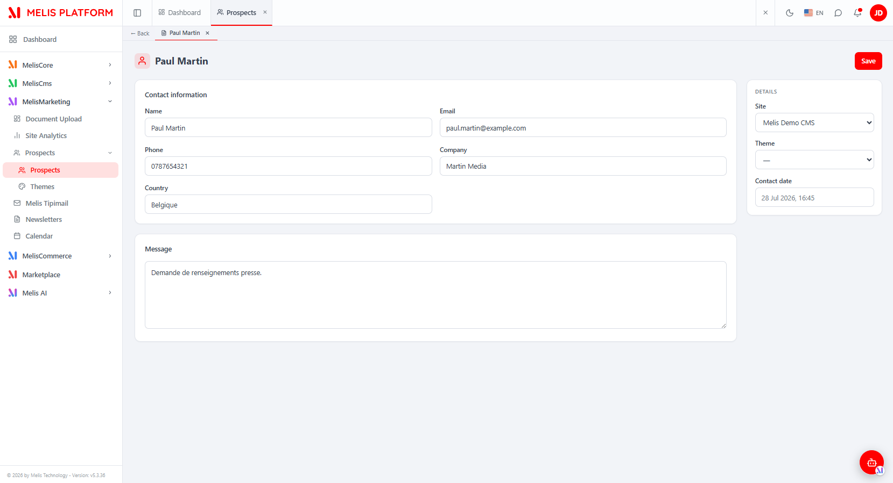
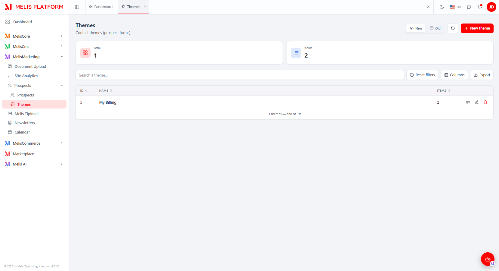
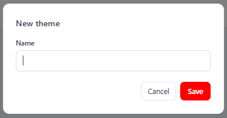
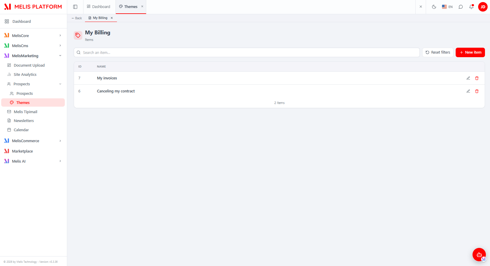
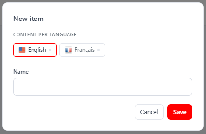
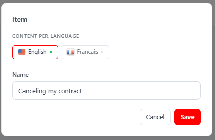
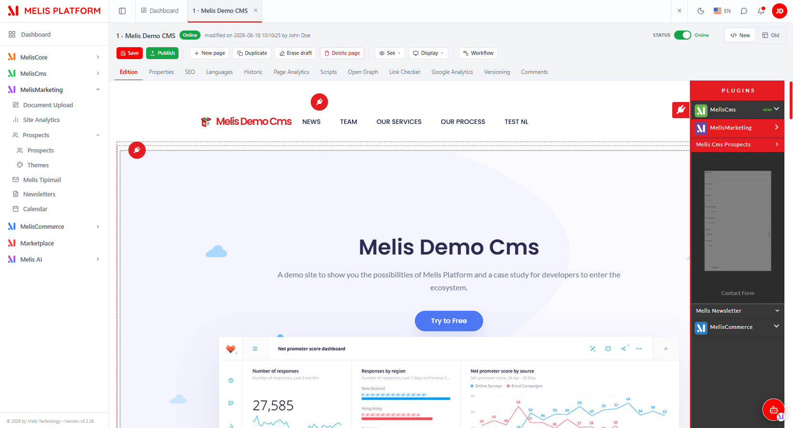
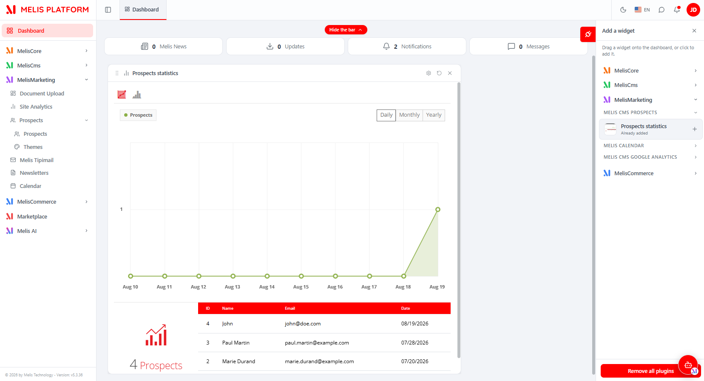

# MelisCmsProspects (React back-office) — Functional & Technical Documentation (for AI)

> **What this is.** MelisCmsProspects is the **leads / contact-management** system of Melis: a
> front **contact form** captures visitors' messages, and the back-office lets you browse, filter,
> edit, export and delete those **prospects**, plus classify contact requests by **themes**. This
> document covers it **in the new React back-office** (`/melis-react`). The module ships **two
> native full-React bricks in one bundle** — **Prospects** and **Themes** — each a real React UI
> calling a `react-api` JSON layer, with a **New / Old toggle** that can fall back to the legacy
> tool in an iframe. For the underlying data model, services, the **Show Form** plugin and the
> **GDPR** wiring, see the [legacy tool doc](./MelisCmsProspects.md); this doc does not repeat them.
>
> **How this document is organised — two clearly separated parts:**
> - **[Part A — Functional Guide](#part-a--functional-guide)** — for everyday users (and the
>   chat assistant) using the React back-office. Plain language.
> - **[Part B — Technical Reference](#part-b--technical-reference)** — for developers and AI
>   building inside the React UI, with code (brick manifest, endpoints, capabilities).
>
> **Audience**: consumed by the **MelisAI** MCP. **Status**: reviewed 2026-08-19.

---

## 0. Where this lives in the React back-office — read this first

- **Brick kind: native full-React** (not iframe bricks). Both UIs are authored in React
  (`ui-react/src/`) and read/write through `/melis/react-api/…` endpoints defined by the module.
  Each tool also keeps a **New / Old toggle**: *Old* renders the legacy tool in an iframe
  (`/melis/react-tool-page?key=<melisKey>`), *New* is the React UI (default).
- **Multi-brick bundle.** `public/ui-react/brick.manifest.json` declares **two bricks** in one
  `brick.js`: **`prospects`** (route `/prospects`) and **`prospect-themes`** (route
  `/prospect-themes`). `brick.tsx` self-registers both by id.
- **Where in the menu.** Left sidebar → **MelisMarketing** group → **Prospects** → **Prospects**
  and **Themes** (each opens as its own top tab). The tools appear **only if the module is
  activated** (modular brick discovery, see §B5).
- **Sub-tabs (drill-down).** Both tools surface an opened record as a **host sub-tab**: a prospect
  opens the **prospect form**; a theme opens its **Items** panel.
- **Coupled features (legacy doc).** The front **Show Form** block, the **Prospects Statistics**
  dashboard widget and the **GDPR** listeners are unchanged by the React migration — they live in
  the [legacy doc](./MelisCmsProspects.md). The Show Form plugin still opens in the classic
  page-editor modal (screenshots below).

---
---

# PART A — Functional Guide

## A1. What you can do with MelisCmsProspects in the new back-office

- **Manage leads (Prospects tool)** — browse every contact request, filter by site / type / date,
  full-text **search**, **sort**, **edit** a lead, **delete** it, and **export to CSV/Excel**.
  Prospects are **not created** here — they arrive only from the front contact form.
- **Classify requests (Themes tool)** — create/rename/delete **themes**, and edit a theme's
  **items** (its subject categories), each item translatable **per language**.
- **Compare New vs Old** — switch either tool between the React UI and the classic tool with the
  **New / Old** toggle.
- **Collect leads & show trends** — the front **Show Form** block (page editor) and the
  **Prospects Statistics** dashboard widget (both covered in the [legacy doc](./MelisCmsProspects.md)).

## A2. Finding it in /melis-react

**Where:** left sidebar → **MelisMarketing** → **Prospects** → **Prospects** / **Themes**. Each
opens as its own top tab.


*The React Prospects tool: KPI cards (Total / This month / Average per month / Anonymized), search, All-sites and All-types filters, a Date range picker, Reset filters, a Columns manager, Export, the New/Old toggle and a refresh button. Each row has edit and delete actions.*

## A3. Key words explained

- **Prospect (lead)** — one contact request captured by the front Show Form block (site, name,
  email, phone, company, country, message, type, theme, contact date). Rows in the Prospects list.
- **Theme** — a subject/category of contact request; it feeds the contact form's subject dropdown.
- **Theme item** — an entry under a theme (its "category"), with a **name per language**.
- **New / Old** — the two views of the same tool: **New** = React UI, **Old** = the classic tool in an iframe.
- **Sub-tab** — an opened prospect (or a theme's Items panel) appears as a tab under the top bar (drill-down).

> For the domain glossary and the data model, see the [legacy doc](./MelisCmsProspects.md).

## A4. Prospects — the list (Prospects tool)

You see **every prospect on the platform**. The list has **four KPI cards** (Total, This month,
Average per month, Anonymized), a **search** box (searches name, email, phone and company), a
**site** filter, a **type** filter, a **Date** range picker (Today / Yesterday / Last 7 / Last 30 /
This month / Last month / Custom range), **Reset filters**, a **Columns** manager (hide/reorder
columns, persisted), an **Export** button and a **refresh** button. Click a column header to
**sort** (all columns except *Message* are sortable). Each row has **edit** (opens the prospect
form) and **delete**.

## A5. Prospects — editing a lead

Clicking **edit** opens the prospect as a **sub-tab** (with a **← Back** button) showing a full
React form: a **Contact information** card (Name, Email, Phone, Company, Country), a **Message**
card, and a **Details** side card (**Site** picker, **Theme** picker, and a read-only **Contact
date**). **Save** (top-right) persists the changes.


*The React prospect form — Contact information (name, email, phone, company, country), a Message box, and a Details side card (Site, Theme, read-only Contact date). The sub-tab bar shows the drill-down (← Back · Paul Martin).*

> **Note:** no field is mandatory (parity with the legacy tool); the email is only checked for
> valid format if filled. **Contact date** and **type** are immutable from this screen — they are
> set at capture time by the front form and can never be changed here.

## A6. Themes — the list (Themes tool)

**Where:** left sidebar → **MelisMarketing** → **Prospects** → **Themes**.

The Themes tool lists your themes with **two KPI cards** (Total themes, total Items), a **search**
box, **Reset filters**, a **Columns** manager, **Export**, the **New/Old** toggle and a **+ New
theme** button. Each row shows the theme **name** and its **item count**, with three actions:
**rename** (a one-field modal), **edit** (opens the theme's Items sub-tab) and **delete**.


*The React Themes tool: Total / Items KPI cards, search, Reset filters, Columns, Export, New/Old toggle and "+ New theme". The row exposes rename, edit (open items) and delete.*

**+ New theme** (and **rename**) open a small modal with a single **Name** field.


*The "New theme" modal — a single Name field (the code is preserved by the back-end, not entered here).*

## A7. Themes — editing a theme's items

Clicking **edit** on a theme opens its **Items** panel as a **sub-tab** (← Back + theme name). It
lists the theme's items (id + name), with **live search**, **Reset filters** and **+ New item**.
Each row has **edit** and **delete**.


*Editing a theme ("My Billing") reveals its Items panel — a searchable list of items with per-row edit/delete and a "+ New item" button; the drill-down shows as a sub-tab.*

Adding or editing an item opens a modal that captures a **name per CMS language** — a row of
language tabs (with a flag and a green "filled" dot per language) plus the **Name** field for the
active language. At least one language must be filled.


*The "New item" modal — "Content per language" tabs (English / Français) and the Name field for the active language.*


*The "Item" modal editing an existing item ("Canceling my contract"); the green dot marks the language that already has content.*

## A8. The contact form & dashboard (unchanged by React)

The front **Show Form** block is still configured from the **classic page editor** modal. From the
React page editor, open the **plugins** panel and drop the **Show Form** block (under **Melis Cms
Prospects**).


*The React page editor with the plugins panel open — the "Contact Form" block sits under the "Melis Cms Prospects" group, ready to drop onto the page.*

Its settings modal keeps its three tabs — **Properties** (template + source site), **Field list**
(the field-builder: Show/Hide, Mandatory, drag-to-order) and **Themes** (the subject theme):


*Show Form — Properties: the rendering template and the source site.*


*Show Form — Field list: the field-builder — per field a Show/Hide switch and a Mandatory checkbox; rows are drag-sortable so their order is the form order.*


*Show Form — Themes: the theme that drives the form's subject dropdown (with a wrench shortcut to the Themes tool).*

On the back-office **Dashboard**, the **Prospects Statistics** widget charts registrations over time.


*The "Prospects statistics" dashboard widget — a Daily/Monthly/Yearly registrations chart plus a table of the most recent prospects, added from the "Add a widget" panel (MELIS CMS PROSPECTS group).*

## A9. Common tasks — "How do I…?"

- **See & filter my leads** → Prospects tool → search / site / type / Date range → sort by any column.
- **Export leads** → Prospects tool → filter as needed → **Export** (Excel/CSV).
- **Edit a lead** → Prospects list → the pencil icon → change fields → **Save**.
- **Delete a lead** → Prospects list → the trash icon → confirm.
- **Add a contact theme** → Themes tool → **+ New theme** → name it.
- **Rename a theme** → Themes list → the rename icon.
- **Manage a theme's subjects** → Themes list → the pencil (edit) icon → **+ New item** → fill a name per language.
- **Compare with the classic tool** → top-right **New / Old** toggle → **Old**.
- **Put a contact form on a page** → React page editor → Edition → drag **Show Form** → set Field list + Themes.

---
---

# PART B — Technical Reference

## B1. React presence at a glance

Two bricks in one bundle (`brick.manifest.json` → `bricks: [...]`):

| Item | Prospects brick | Themes brick |
|---|---|---|
| Brick kind | **Native full-React** (+ New/Old legacy-iframe fallback) | **Native full-React** (+ New/Old legacy-iframe fallback) |
| Brick id | `prospects` | `prospect-themes` |
| Manifest `route` | `/prospects` | `/prospect-themes` |
| `label` | `Prospects` | `Themes` |
| `forwardKey` | `MelisCmsProspects/ToolProspects` | `MelisCmsProspects/ProspectThemes` |
| `melisKey` (manifest / Old-view iframe = renderable ZONE key) | `MelisCmsProspects_tool_prospects` | `MelisCmsProspects_tool_themes` |
| `entry` | `brick.js` | `brick.js` |
| `subTabs` | `true` | `true` |
| `persistent` | `true` | `true` |
| Access-guard **and** capability melisKey (rights-bearing node) | `melisprospects_tool_prospects_section` | `melisprospects_tool_themes_section` |
| API base | `/melis/react-api/prospects` | `/melis/react-api/prospect-themes` |
| React-api controller | `MelisReactApiProspectController` | `MelisReactApiProspectThemeController` |

Shared: package `melisplatform/melis-cms-prospects`, category `cms`, namespace `MelisCmsProspects\`.
Tables (owned): `melis_cms_prospects`, `melis_cms_prospects_themes`,
`melis_cms_prospects_theme_items`, `melis_cms_prospects_theme_items_trans` — see
[legacy doc §B2](./MelisCmsProspects.md). **Activation-gated** (appears iff the module is active).

> ⚠ The manifest `melisKey` (`MelisCmsProspects_tool_prospects` / `_tool_themes`) is the
> renderable **ZONE** key used for the Old-view iframe — **rights do NOT hang on it**. The
> rights-bearing menu node (used by the access guard *and* the capabilities) is
> `melisprospects_tool_prospects_section` / `melisprospects_tool_themes_section`
> (`config/app.interface.php`).

## B2. The bricks — anatomy

Source in `ui-react/` (Vite **IIFE**, React externalised to the host globals `MelisReact*`, built
to `public/ui-react/brick.js` next to `brick.manifest.json`). The **single** `brick.js` carries
both tools; `brick.tsx` registers **two** routed components by id:

```tsx
import ProspectsPage from './ProspectsPage'
import ProspectThemesPage from './ProspectThemesPage'
// Each id MUST match an entry of public/ui-react/brick.manifest.json (`bricks` array).
window.__melisRegisterBrick?.({ id: 'prospects',        Component: ProspectsPage })
window.__melisRegisterBrick?.({ id: 'prospect-themes',  Component: ProspectThemesPage })
```

Manifest (`public/ui-react/brick.manifest.json`):
```json
{ "bricks": [
  { "id": "prospects", "route": "/prospects", "label": "Prospects",
    "forwardKey": "MelisCmsProspects/ToolProspects", "melisKey": "MelisCmsProspects_tool_prospects",
    "entry": "brick.js", "subTabs": true, "persistent": true },
  { "id": "prospect-themes", "route": "/prospect-themes", "label": "Themes",
    "forwardKey": "MelisCmsProspects/ProspectThemes", "melisKey": "MelisCmsProspects_tool_themes",
    "entry": "brick.js", "subTabs": true, "persistent": true }
] }
```

React components (`ui-react/src/`):

| File | Role |
|---|---|
| `ProspectsPage.tsx` | Container for the **Prospects** brick. `ProspectList` (list, kept mounted / `display:none` when the form is open) drives the KPI cards, search + site/type/date filters, sort, column manager, Export, delete, the **New/Old** iframe fallback, and the **DateRangeFilter** preset popover. `ProspectForm` is the drill-down edit form (host sub-tab). `CAPS_KEY = 'melisprospects_tool_prospects_section'`, `MELIS_KEY = 'MelisCmsProspects_tool_prospects'` (Old-view iframe). |
| `ProspectThemesPage.tsx` | Container for the **Themes** brick. `ThemeList` (list + `ThemeModal` create/rename), `ThemeForm` (the theme's **Items** sub-tab), `ThemeItemsPanel` (items list + live search) and `ThemeItemForm` (per-language name modal). `CAPS_KEY = 'melisprospects_tool_themes_section'`, `MELIS_KEY = 'MelisCmsProspects_tool_themes'`. Publishes the active view to the host via `window.__melisSetToolView(MELIS_KEY, mode)`. |
| `ViewToggle.tsx` | The reusable **New (React) / Old (iframe)** toggle (`type ViewMode = 'react' \| 'iframe'`), inline-styled, with a `compact` mode for mobile. |
| `ExportModal.tsx` | The list Export (Excel `.xlsx` via the host `window.MelisXLSX`, CSV fallback; Included/Excluded drag panels; exports **all** rows via a `fetchAll` cursor loop). Used by both tools. |
| `prospects-api.ts` | Prospects API client (see §B3) + `markProspectsListStale()`/`consumeProspectsListStale()`. |
| `prospect-themes-api.ts` | Themes + theme-items API client (see §B3) + `markThemesListStale()`/`consumeThemesListStale()`. |
| `use-keyset-list.ts` | Keyset (cursor) infinite-list hook used by both list pages. |
| `shared/` | `use-drag-reorder.ts` (touch-friendly column reorder), `ExpandableRow.tsx` (mobile "+" hidden-columns row), `melis-form-errors.tsx`, `useIsNarrow.ts`. |

> **Brick constraint:** the bundle externalises only `react`/`react-dom`/`react/jsx-runtime`/
> `react-router-dom` to host globals; it cannot import host modules (Tailwind/shadcn/lucide/i18n),
> hence inline styles + an in-file `{fr,en}` dictionary read from `document.documentElement.lang`.

## B3. React API — endpoints

Routes live in **`config/react-api.php`** (merged via `MelisCmsProspects\Module::getConfig()`
with `ArrayUtils::merge`). All under `/melis/react-api/`, contract `{ success, data, error }`, every
fetch sends `X-Requested-With: XMLHttpRequest` + `credentials:'include'`.

### B3.1 Prospects — `MelisReactApiProspectController` (invokable `MelisCmsProspects\Controller\MelisReactApiProspect`)

| Method & URL | Action | Purpose |
|---|---|---|
| `GET /melis/react-api/prospects` | `list` | Keyset list (`limit,search,site,type,dateFrom,dateTo,sort,dir,after`) → `{items,total,nextCursor}` |
| `GET /melis/react-api/prospects/stats` | `stats` | KPIs `{total, thisMonth, avgPerMonth, anonymized}` |
| `GET /melis/react-api/prospects/sites` | `sites` | Site filter options `{sites:[{id,name}]}` |
| `GET /melis/react-api/prospects/types` | `types` | Distinct `pros_type` values `{types:[…]}` |
| `GET /melis/react-api/prospects/themes` | `themes` | Theme-item options for the form's Theme picker `{themes:[{id,name,themeName}]}` |
| `GET /melis/react-api/prospects/:id` | `get` | One prospect (formatted) |
| `POST /melis/react-api/prospects/save` | `save` | **Update only** (no create); `contact date` & `type` immutable server-side |
| `DELETE /melis/react-api/prospects/delete/:id` | `delete` | Delete a prospect |

### B3.2 Themes & items — `MelisReactApiProspectThemeController` (invokable `MelisCmsProspects\Controller\MelisReactApiProspectTheme`)

| Method & URL | Action | Purpose |
|---|---|---|
| `GET /melis/react-api/prospect-themes` | `list` | Keyset list of themes (`limit,search,sort,dir,after`) → `{items,total,nextCursor}` with `itemCount` |
| `GET /melis/react-api/prospect-themes/stats` | `stats` | KPIs `{total, withCode, items}` |
| `GET /melis/react-api/prospect-themes/:id` | `get` | One theme `{id,name,code,itemCount}` |
| `POST /melis/react-api/prospect-themes/save` | `save` | Create (id=0) / update a theme (name required ≤45, unique; code preserved if absent) |
| `DELETE /melis/react-api/prospect-themes/delete/:id` | `delete` | Delete a theme + its items + their translations (cascade) |
| `GET /melis/react-api/prospect-themes/languages` | `languages` | CMS languages `{languages:[{id,name,locale}]}` |
| `GET /melis/react-api/prospect-themes/items?themeId=X` | `items` | A theme's items `{items:[{id,name}],total}` (name in the session language) |
| `GET /melis/react-api/prospect-themes/items/:id` | `itemGet` | One item `{id,themeId,translations:{langId:text}}` |
| `POST /melis/react-api/prospect-themes/items/save` | `itemSave` | Create/update an item (≥1 non-empty translation; per-lang upsert/delete) |
| `DELETE /melis/react-api/prospect-themes/items/delete/:id` | `itemDelete` | Delete an item + its translations |

> The literal `/languages` and `/items[...]` routes are declared **before** the catch-all
> `/prospect-themes/:id` (`:id` constrained to `[0-9]+`) so they don't collide.

Example (from the API clients):
```ts
// list prospects (keyset)
await apiFetch<ProspectListResult>('/melis/react-api/prospects?limit=25&sort=date&dir=desc')
// update a prospect (no create)
await apiFetch<{id:number}>('/melis/react-api/prospects/save', {
  method: 'POST', headers: { 'Content-Type': 'application/json' },
  body: JSON.stringify({ id: 3, siteId: 1, name: 'Paul Martin', email: 'paul.martin@example.com',
    telephone: '0787654321', message: '…', company: 'Martin Media', country: 'Belgique', theme: null }),
})
// create a theme
await apiFetch<{id:number}>('/melis/react-api/prospect-themes/save', {
  method: 'POST', headers: { 'Content-Type': 'application/json' },
  body: JSON.stringify({ id: 0, name: 'My Billing' }),
})
// save a theme item (name per language)
await apiFetch<{id:number}>('/melis/react-api/prospect-themes/items/save', {
  method: 'POST', headers: { 'Content-Type': 'application/json' },
  body: JSON.stringify({ id: 0, themeId: 2, translations: { '1': 'My invoices', '2': 'Mes factures' } }),
})
```

> **Note on the data layer.** Both controllers talk to the tables **directly via parameterised
> SQL** (`Laminas\Db\Adapter\AdapterInterface`) — keyset lists via `MelisReactKeysetListTrait` —
> reproducing the legacy business rules (prospect: name/email ≤255, phone charset `^[0-9()/+ -]*$`,
> contact-date/type immutable; theme: name ≤45 unique, code ≤45 unique, cascade delete). The
> higher-level `MelisCmsProspectsService` (legacy doc §B3) is not used here. The Themes controller
> also **fires the legacy log events** (`meliscmsprospects_theme_save_end` / `_delete_end` /
> `meliscmsprospects_theme_item_save_end`) so the module's flash/log listeners still work; the
> Prospects controller fires `meliscmsprospects_toolprospects_save_end` / `_delete_end`.

## B4. Capabilities (advanced rights)

Declared in **`config/react.capabilities.php`** (`melisReactToolCapabilities`, keyed per tool by
the **rights-bearing** menu-node melisKey). `Capabilities::flatten()` turns the tree into dotted
strings passed to `MelisCan(melisKey, cap)` in React and to `denyUnlessCan(cap)` server-side.
`Capabilities` is **default-allow** for an undeclared cap.

```php
'melisprospects_tool_prospects_section' => ['list', 'edit', 'delete', 'export'],  // NO create
'melisprospects_tool_themes_section' => [
    'actions' => ['create', 'list', 'edit', 'delete', 'export'],
    'tabs' => [
        ['key' => 'items', 'label' => 'tr_melis_cms_prospects_theme_items',
         'actions' => ['list', 'create', 'edit', 'delete']],  // → items · items.list · items.create · items.edit · items.delete
    ],
],
```

- **Prospects** flattened: `list`, `edit`, `delete`, `export`. (No `create` — a prospect is only
  born from the public contact form.)
- **Themes** flattened: `create`, `list`, `edit`, `delete`, `export`, plus the `items` sub-tab:
  `items`, `items.list`, `items.create`, `items.edit`, `items.delete`.

Guarding in each controller action (twice):
```php
private const MELIS_KEY = 'melisprospects_tool_prospects_section'; // (themes ctrl: …_themes_section)
if ($deny = $this->denyUnlessAccess())         { return $deny; }    // auth + MelisCoreRights::canAccess(MELIS_KEY) → 401/403
if ($denyCap = $this->denyUnlessCan('list'))   { return $denyCap; } // capability (CapabilityGuardTrait)
```
`save` picks `edit` vs `create` by id (`itemSave` picks `items.edit` vs `items.create`). The
React side gates buttons with `can('edit')`, `can('export')`, `can('items')`, `can('items.create')`, etc.

## B5. Host integration

- **Discovery / gating.** `GET /melis/react-api/react-modules` lists active modules that ship a
  `brick.manifest.json`; the host (`melis-core/ui-react/src/lib/bricks.ts`) loads `brick.js` (shared
  React globals) and mounts **both** registered bricks. Removing `MelisCmsProspects` from
  `config/melis.module.load.php` makes both tools disappear.
- **Menu → route.** `useNavMenu` maps `forwardKey` `MelisCmsProspects/ToolProspects` → the Prospects
  tree route and `MelisCmsProspects/ProspectThemes` → the Themes tree route; the manifest `route`s
  (`/prospects`, `/prospect-themes`) are the fallbacks.
- **Sub-tabs (`subTabs: true`).** Each brick drives the host's **native** sub-tab bar via the window
  bridge (it cannot import the host store): `window.__melisOpenSubTab(section, {id,label,path})`,
  `__melisUpdateSubTabLabel`, `__melisCloseSubTab`. `section` = the tool's tree route
  (from `useLocation()`); a sub-tab per opened prospect / per opened theme's Items panel; the list
  stays mounted (hidden) so state/scroll survive.
- **New/Old toggle.** The Themes page reports the active view with
  `window.__melisSetToolView(MELIS_KEY, mode)` so the host hides the legacy iframe's tabs in **New**
  mode. *Old* iframe target: `/melis/react-tool-page?key=MelisCmsProspects_tool_prospects` (resp.
  `…_tool_themes`), served by `MelisReactOverride`.
- **i18n.** Both bricks read the language from `document.documentElement.lang` and ship an in-file
  `{fr,en}` dictionary. Language flags come from `/MelisCore/assets/images/lang/<xx>.png`.
- **Generic bits stay in `melis-react-api`.** `CapabilityGuardTrait` + the `Capabilities` resolver
  are generic; the tools' controllers/routes/caps live **in this module** (modularity rule).

## B6. Quick code map

```
melis-cms-prospects/
├── config/
│   ├── react-api.php            routes (/melis/react-api/prospects… + /prospect-themes…)
│   │                            + invokables → MelisReactApiProspect / MelisReactApiProspectTheme
│   └── react.capabilities.php   melisReactToolCapabilities keyed on
│                                melisprospects_tool_prospects_section & …_themes_section
├── src/Controller/
│   ├── MelisReactApiProspectController.php        8 actions, denyUnlessAccess + denyUnlessCan, direct SQL
│   └── MelisReactApiProspectThemeController.php   10 actions (themes + items), full CRUD + legacy log events
├── ui-react/                    Vite IIFE bundle (React external) → ../public/ui-react/brick.js
│   └── src/  brick.tsx (registers 'prospects' + 'prospect-themes')
│            · ProspectsPage.tsx (Old iframe) · ProspectThemesPage.tsx (Old iframe)
│            · ViewToggle.tsx · ExportModal.tsx · prospects-api.ts · prospect-themes-api.ts
│            · use-keyset-list.ts · shared/{use-drag-reorder,ExpandableRow,melis-form-errors,useIsNarrow}
├── public/ui-react/             brick.js (built) + brick.manifest.json (bricks: [prospects, prospect-themes])
└── etc/MelisAI/doc/             MelisCmsProspects.md (legacy) · MelisCmsProspects-react.md (this)
                                 · images/ · images/react/
```

> Business logic stays server-side (parity with the legacy tools); React = presentation + API calls.
> Underlying data model, `MelisCmsProspectsService`, the Show Form plugin, the dashboard widget and
> the GDPR listeners: [MelisCmsProspects.md](./MelisCmsProspects.md).

---

## Screenshot index

Filename → content lookup for the MelisAI MCP. All under `./images/react/`.

| Image file | Content |
|---|---|
| `meliscmsprospects-tool-prospects-list.png` | React Prospects list — 4 KPI cards, search, site/type/date filters, Reset filters, Columns, Export, New/Old toggle, row edit/delete |
| `meliscmsprospects-tool-prospects-edit.png` | React prospect edit form (sub-tab) — Contact information, Message, Details side card (Site, Theme, read-only Contact date) |
| `meliscmsprospects-tool-themes-list.png` | React Themes list — Total/Items KPIs, search, Columns, Export, New/Old toggle, "+ New theme", row rename/edit/delete |
| `meliscmsprospects-tool-themes-new-modal.png` | "New theme" modal — single Name field |
| `meliscmsprospects-tool-themes-edit-themecategorylist.png` | A theme's Items panel (sub-tab) — searchable item list, per-row edit/delete, "+ New item" |
| `meliscmsprospects-tool-themes-edit-themecategorylist-new-modal.png` | "New item" modal — Content-per-language tabs + Name field |
| `meliscmsprospects-tool-themes-edit-themecategorylist-edit-modal.png` | "Item" modal editing an existing item — language tabs (filled dot) + Name |
| `meliscmsprospects-page-menu-plugins-selector.png` | React page editor — Show Form / Contact Form block under "Melis Cms Prospects" in the plugins panel |
| `meliscmsprospects-page-plugin-showform-config-tab-properties.png` | Show Form — Properties tab (template + site) |
| `meliscmsprospects-page-plugins-showform-config-tab-fieldlist.png` | Show Form — Field list tab (field-builder: Show/Hide, Mandatory, drag order) |
| `meliscmsprospects-page-plugin-showform-config-tab-themes.png` | Show Form — Themes tab (subject theme) |
| `meliscmsprospects-dashboard-plugin-prospectsstatistics.png` | Prospects Statistics dashboard widget — Daily/Monthly/Yearly chart + recent-prospects table |

---

*Document for AI consumption (MelisAI MCP) — React back-office of `melisplatform/melis-cms-prospects`.
Part A = functional guide for users; Part B = technical reference with examples for developers/AI.
Legacy tool doc: [./MelisCmsProspects.md](./MelisCmsProspects.md). Last reviewed 2026-08-19.*
