# MelisCmsProspects Module — Functional Documentation (for AI)

> **Purpose of this document**: describe, functionally and technically, the
> `melisplatform/melis-cms-prospects` module, so that an AI (or a developer) can understand
> *what the module does*, *which tools it provides*, *how they work* and
> *where the corresponding code lives*.
>
> **Audience**: consumed by the **MelisAI** module (a MelisPlatform module that exposes an
> MCP function to answer user questions). MelisAI fetches this `.md` file and the
> screenshots in `./images/` **on demand** — so the doc is self-contained and §9 acts as
> the filename→content index for retrieving a specific screenshot.
>
> **Status**: reviewed 2026-06-08 against the current source. The module carries no
> semantic version (no `version` in `composer.json`), so treat this doc as describing the
> current `melisplatform/melis-cms-prospects` source rather than a tagged release.
>
> Screenshots live in `./images/` (relative paths `./images/...`).

---

## 1. Overview

`MelisCmsProspects` is the **prospects / leads management** module of the Melis platform.
It captures **prospects** (contact-form leads) submitted from a site's front-office, stores
them, and gives editors a back-office tool to browse, filter, edit, export (CSV) and delete
them — with usage statistics and GDPR tooling. Leads can be classified by **themes** (the
subject/category of the contact request), which the module also lets you manage.

| Item | Value |
|---|---|
| Package name | `melisplatform/melis-cms-prospects` |
| Type | `melisplatform-module` |
| PHP namespace | `MelisCmsProspects\` → `src/` (PSR-4) |
| Melis category | `cms` |
| License | OSL-3.0 |
| PHP required | `^8.1 | ^8.3` |
| Framework | Laminas (ex-Zend Framework 2/3), Melis MVC architecture |
| dbdeploy | `true` (DB migrations applied automatically) |

### Dependencies (required Melis modules)

The module does not run standalone. It relies on:

- `melisplatform/melis-core` (`^5.2`) — foundation, general services, events, rights, translations, GDPR framework, dashboard
- `melisplatform/melis-engine` (`^5.2`) — page engine, templates, front rendering
- `melisplatform/melis-front` (`^5.2`) — front-office management
- `melisplatform/melis-cms` (`^5.2`) — CMS, pages, sites management
- `laminas/laminas-mvc-plugin-flashmessenger` (`^1.10`) — back-office flash messages

### Platform integrations — features that light up via MelisCore

> This is the place that describes capabilities provided through other (core) platform
> features rather than this module's own tool. They are part of the **MelisCore** platform
> (not separate installable modules), so they are present in a standard Melis install:

- **GDPR** — the module plugs into MelisCore's GDPR / right-to-be-forgotten and
  **auto-delete** framework through a set of listeners (§4.1): exposing prospect data in
  the GDPR user info/extract/delete screens, and feeding the auto-delete warning/deletion
  cycle (warning lists, second warning, account deletion). Configured in
  `config/app.gdpr.php`.
- **Dashboard** — the **Prospects Statistics** widget (§3.5) appears on the MelisCore
  back-office **Dashboard** (section *MelisMarketing*), rendering registration charts.

When the surrounding platform features are present (standard install), these light up
automatically; the core Prospects tool and front contact-form plugin work regardless.

---

## 2. Functional concepts

- **Prospect (lead)**: a contact submitted from the front-office contact form — name,
  email, telephone, message, company, country — bound to a **site** and an optional
  **theme** and **type**, with a contact date. Each prospect also carries a
  `pros_gdpr_lastdate` used by the GDPR auto-delete cycle.
- **Theme**: a subject/category of contact request (a name + a code). Used to classify
  prospects and to drive the contact form's subject dropdown.
- **Theme item**: an entry belonging to a theme, with **translatable** text (one row per
  language) — e.g. the selectable options under a theme.

### Data model (MySQL tables)

| Table | Role | Primary key |
|---|---|---|
| `melis_cms_prospects` | The prospect/lead (site, type, theme, name, email, telephone, message, company, country, contact date, gdpr last date) | `pros_id` |
| `melis_cms_prospects_themes` | Theme (`pros_theme_name`, `pros_theme_code`) | `pros_theme_id` |
| `melis_cms_prospects_theme_items` | Items belonging to a theme | `pros_theme_item_id` |
| `melis_cms_prospects_theme_items_trans` | Per-language translations of a theme item (`item_trans_text`, `item_trans_lang_id`, `item_trans_theme_item_id`) | `item_trans_id` |

- A prospect references a theme via `melis_cms_prospects.pros_theme` → `melis_cms_prospects_themes.pros_theme_id`.
- MySQL Workbench model: `install/sql/Model/MelisCmsProspects.mwb`
- Base structure: `install/sql/setup_structure.sql`
- Incremental migrations: `install/dbdeploy/*.sql` (install, updates, utf8mb4 conversion)

---

## 3. Tools and elements provided

The module exposes these functional elements:

1. **The Prospects tool (back-office)** — list, stats widgets, filters, edit, CSV export
2. **The Themes tool** and **Theme Items tool** (back-office)
3. **1 front-office templating plugin** — Show Form (the contact form)
4. **1 dashboard plugin** — Prospects Statistics
5. **An application service** + micro-services + reusable form elements

---

### 3.1 Prospects tool (back-office)

Accessible from the Melis back-office left menu (icon `fa-user-plus` / `fa-list-ol`).
Declared in `config/app.interface.php` (key `melistoolprospects_tool_prospects`).

- **Controller**: `src/Controller/ToolProspectsController.php` (entry action `renderProspects`)
- **Table configuration**: `config/app.tools.php` (key `melistoolprospects_tool_prospects`)
- **Views**: `view/melis-cms-prospects/tool-prospects/*.phtml`

**Stats widgets** (top of the tool): total prospects
(`renderToolProspectsWidgetNumProspectsAction`), prospects this month
(`...WidgetNumProspectsThisMonthAction`), average per month
(`...WidgetProspectsAveragePerMonthAction`).

**The list** is a Melis DataTable with columns: ID, site, name, email, type, telephone,
contact date, theme, message. Data loads via AJAX from
`/melis/MelisCmsProspects/ToolProspects/getToolProspectData` (`getToolProspectDataAction`).

Filters: **limit**, **date** (date-range picker), **site**, **type** (left); **search**
(center); **export to CSV** (`renderToolProspectsContentFiltersExportAction` /
`exportToCsvAction`) and **refresh** (right).

Per-row actions:
- **Edit** (`renderToolProspectsActionEditAction`) — opens the update modal
  (`renderToolProspectUpdateFormAction`, form `melistoolprospects_tool_prospects_update`);
  save via `updateProspectDataAction`.
- **Delete** (`renderToolProspectsActionDeleteAction` / `removeProspectDataAction`); a
  bulk `removeAllProspectDataAction` also exists.

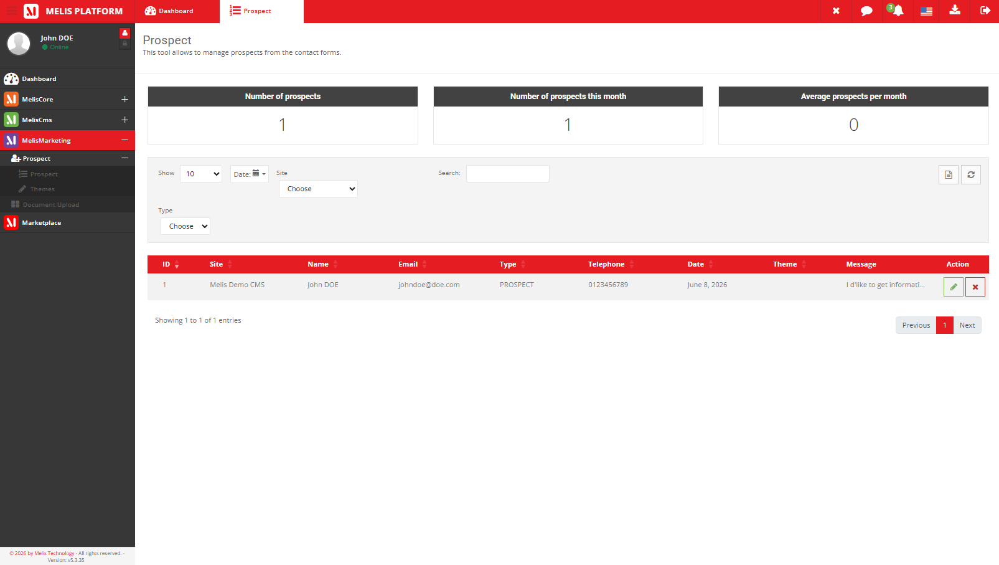
*Caption: the Prospects tool — the three stat widgets (total, this month, monthly average),
the left filters (limit, date range, site, type), search, CSV export, and the prospects
table (id, site, name, email, type, telephone, contact date, theme, message).*

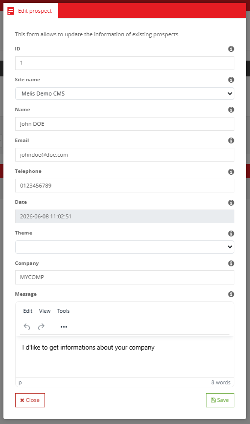
*Caption: the edit-prospect modal — the update form for a single lead's fields.*

---

### 3.2 Themes tool (back-office)

Manage the **themes** used to classify prospects.

- **Controller**: `src/Controller/MelisCmsProspectsThemesController.php`
- **Views**: `view/melis-cms-prospects/melis-cms-prospects-themes/*.phtml`
- **Menu**: `config/app.interface.php` (key `MelisCmsProspects_tool_themes`, icon `fa-pencil`)

A list of themes with **Add** (`toolHeaderAddAction`), **Edit** (`editAction`) and
**Delete** (`deleteAction` / `removeAction`) — create/edit via a modal
(`toolModalContentAction`, `saveAction` → theme name + code). **Editing a theme opens its
item list** (the theme's "categories" — see §3.3).

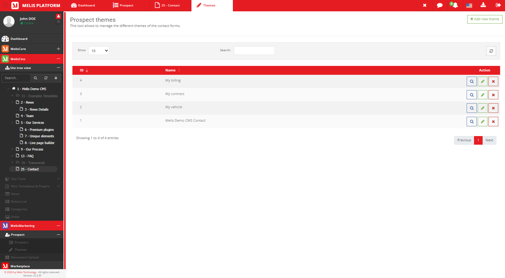
*Caption: the Themes tool — the list of themes (name, code) with Add / Edit / Delete.*

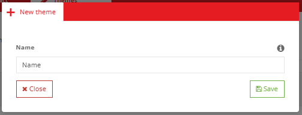
*Caption: the new-theme modal — theme name and code.*

---

### 3.3 Theme items (inside a theme)

Each theme holds a list of **items** (the theme's "categories"), with **translatable**
text per language. The item list is reached by **editing a theme** (§3.2).

- **Controller**: `src/Controller/MelisCmsProspectsThemeItemsController.php`
- **Views**: `view/melis-cms-prospects/melis-cms-prospects-theme-items/*.phtml`

Within a theme, the item list offers **Add** (`toolHeaderAddAction`), **Edit**
(`editAction`), **Delete** (`deleteAction`) and a **code** modal
(`toolModalCodeContainerAction`). Items are saved via `saveItemAction`; their translations
live in `melis_cms_prospects_theme_items_trans`.

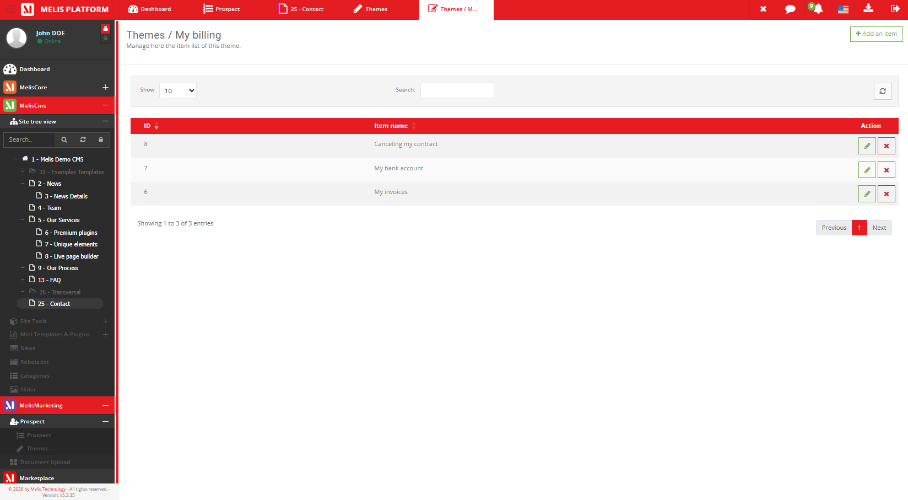
*Caption: editing a theme — its item ("category") list, with Add / Edit / Delete.*

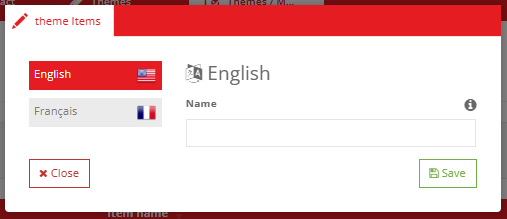
*Caption: the new theme-item modal — the item's per-language text.*

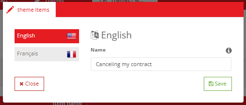
*Caption: the edit theme-item modal — updating an existing item's per-language text.*

---

### 3.4 Front-office plugin — Show Form (contact form)

The templating plugin that renders the **contact form** on a front page; submissions are
saved as prospects.

- **Role**: render a configurable contact/lead form; on submit, create a prospect in
  `melis_cms_prospects` bound to the page's site (and optional theme).
- **Controller Plugin**: `src/Controller/Plugin/MelisCmsProspectsShowFormPlugin.php`
- **Config**: `config/plugins/MelisCmsProspectsShowFormPlugin.config.php`
- **Rendering template**: `view/melis-cms-prospects/plugins/prospects-form.phtml`
- **Config modal — 3 tabs**:
  - **Properties** (`prospect-melis-modal-form-tab-1.phtml`): `template_path`,
    `pros_site_id`
  - **Fields** (`prospect-melis-modal-form-tab-2.phtml`): **the field-builder table — see
    below.** This is the key tab.
  - **Theme** (`prospect-melis-modal-form-tab-1.phtml`): the `theme` driving the form's
    subject options

#### The Fields tab — building the form without code (key feature)

The **Fields** tab is the heart of the plugin: it is a **tabulation (one row per available
field)** that lets a user **compose the contact form visually**, with no code. Each row has
three columns:

1. **Field** — the field label (e.g. Name, Company, Country, Email, Telephone, Message…).
2. **Status** — a **Show / Hide switch** that decides whether the field appears on the
   rendered form. Toggling it on adds the field to the `fields` list.
3. **Mandatory** — a checkbox that makes the field **required**, adding it to the
   `required_fields` list. It is **enabled only when the field's Status is "Show"** — a
   hidden field cannot be required (toggling a field off also clears and disables its
   Mandatory checkbox).

Rows are **drag-and-drop sortable**, so the **order of the rows sets the order of the
fields on the rendered form**. In short, from this one tab a user controls *which* fields
show, *which* are required, and *in what order* — the form is built entirely here.

The two resulting config values are `fields` (shown fields) and `required_fields`
(required subset), persisted in the plugin's page XML. Available form fields include
`pros_name`, `pros_company`, `pros_country`, `pros_email`, `pros_telephone`,
`pros_message` (plus theme/type).

Standard plugin lifecycle: `front()`, `createOptionsForms()` / `getFormData()`,
`loadDbXmlToPluginConfig()` / `savePluginConfigToXml()`.

Plugin selector thumbnail: `public/plugins/images/MelisCmsProspectsShowFormPlugin_thumb.jpg`.

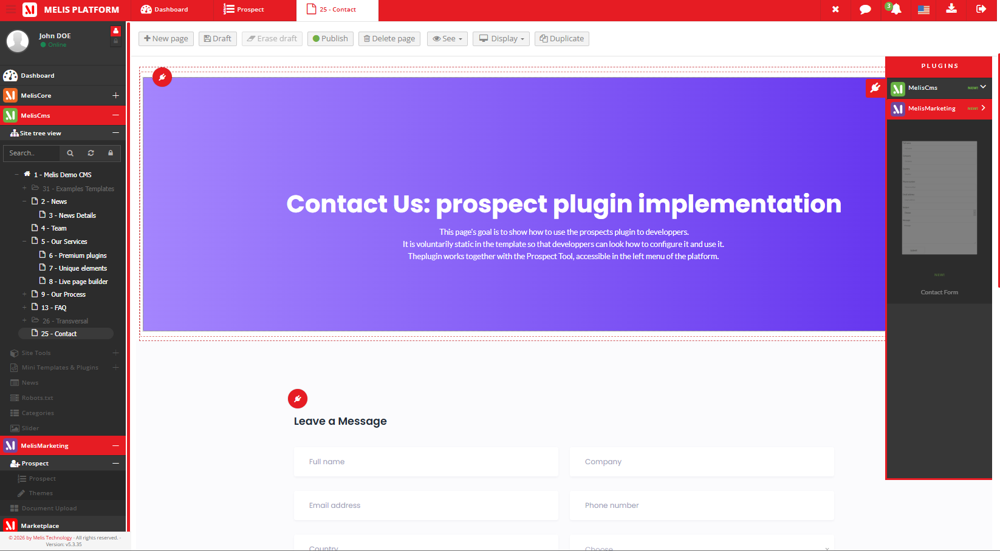
*Caption: the Melis page editor's plugin selector (MelisMarketing section) showing the Show
Form plugin thumbnail.*

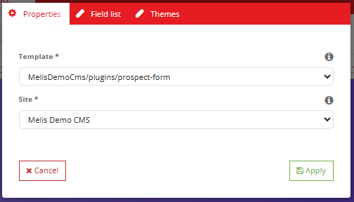
*Caption: Show Form › Properties tab — rendering template and source site.*

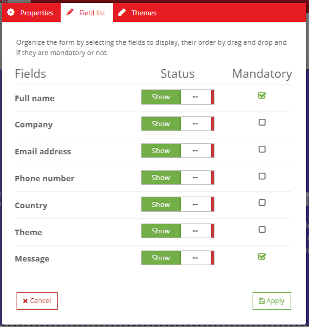
*Caption: Show Form › Fields tab — the field-builder table: one row per field with a
Show/Hide switch (Status), a Mandatory checkbox (enabled only when shown), and drag-to-
reorder rows. This is where the user chooses which fields appear on the contact form, which
are required, and in what order.*

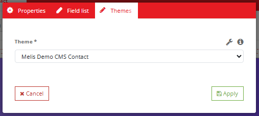
*Caption: Show Form › Theme tab — the theme driving the form's subject options.*

---

### 3.5 Dashboard plugin — Prospects Statistics

- **Plugin**: `src/Controller/DashboardPlugins/MelisCmsProspectsStatisticsPlugin.php`
  (`prospectsStatistics`, `getDashboardStats`)
- **Config**: `config/dashboard-plugins/MelisCmsProspectsStatisticsPlugin.config.php`
- **View**: `view/melis-cms-prospects/dashboard-plugins/prospects-statistics.phtml`
- Renders a **registration chart** on the MelisCore back-office Dashboard (section
  *MelisMarketing*) using Flot charts
  (`public/assets/flotchart/dashboard-line-chart.js`, `dashboard-bar-chart.js`).

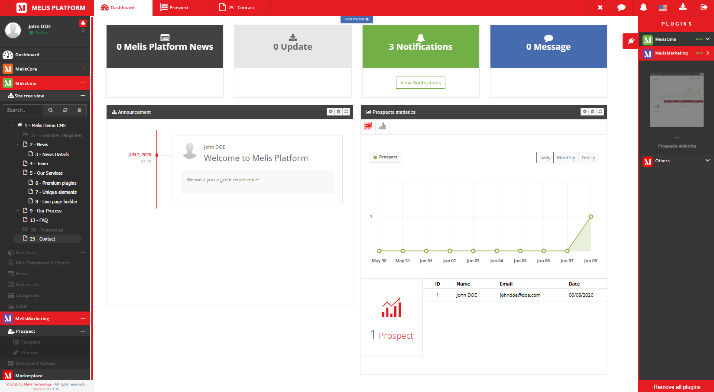
*Caption: the Prospects Statistics dashboard widget — a chart of prospect registrations
over time.*

---

### 3.6 Application service `MelisCmsProspectsService`

- **File**: `src/Service/MelisCmsProspectsService.php`
  (implements `MelisCmsProspectsServiceInterface`)
- **Service manager aliases**: `MelisCmsProspectsService`, `MelisProspectsService`

Retrieval and usage from another module:

```php
$prospects = $this->getServiceManager()->get('MelisProspectsService');

// Number of prospects per month, from a reference date
$nb = $prospects->getProspectsDataByDate('monthly', '2017-10-04 12:00:00');

// Save (or update if $prosId is provided) a prospect
$prosId = $prospects->saveProspectsDatas($datas, $prosId);
```

Main public methods:

| Method | Role |
|---|---|
| `saveProspectsDatas($datas, $prosId = null)` | Create (or update if `$prosId`) a prospect |
| `getProspectsDataForWidgets($widgetId = '')` | Data for the stat widgets (total / this month / monthly average) |
| `getProspectsDataByDate($type, $date)` | Aggregated prospect counts by date (e.g. `monthly`) |
| `getWidgetProspects($identifier)` | Value for a single named widget |

> Unlike some Melis modules, this service does **not** emit per-method `*_start`/`*_end`
> events; it operates directly on the table gateways. The observable **events are fired at
> the controller level** instead — see below.

A complementary **GDPR auto-delete** service exists:
`src/Service/MelisCmsProspectsGdprAutoDeleteService.php`
(alias `MelisProspectsGdprAutoDeleteService`).

#### Controller events

Other modules can `attach()` to these (fired from the controllers, not the service):

| Event | Fired from |
|---|---|
| `meliscmsprospects_toolprospects_save_start` / `_end` | `ToolProspectsController::updateProspectDataAction` |
| `meliscmsprospects_toolprospects_delete_start` / `_end` | `ToolProspectsController::removeProspectDataAction` |
| `meliscmsprospects_theme_save_end` | `MelisCmsProspectsThemesController::saveAction` |
| `meliscmsprospects_theme_delete_end` | `MelisCmsProspectsThemesController::removeAction` |
| `meliscmsprospects_theme_item_save_end` | `MelisCmsProspectsThemeItemsController::saveItemAction` |

#### Tables (Table Gateways)

Declared as aliases in `config/module.config.php`: `MelisProspects`
(→ `melis_cms_prospects`), `MelisCmsProspectsThemeTable`, `MelisCmsProspectsThemeItemTable`,
`MelisCmsProspectsThemeItemTransTable` (in `src/Model/Tables/`). Entity/model classes in
`src/Model/`.

---

### 3.7 Micro-services (API)

- **File**: `config/app.microservice.php`
- Exposes service methods through the Melis micro-service system (automatic form + input
  filter generation), callable over HTTP POST.

---

### 3.8 Reusable form elements

Registered in `config/module.config.php` (`form_elements.factories`):

- `MelisCmsProspectThemeSelect` — dropdown of themes (`ProspectThemeSelectFactory`)
- `MelisCmsProspectThemeItemSelect` — dropdown of theme items (`ProspectThemeItemSelectFactory`)
- `MelisCmsProspectName` — prospect name select (`ProspectNameSelectFactory`)

---

## 4. Extensions and integrations

The module integrates with the Melis back-office and the MelisCore GDPR framework through
**listeners** registered in `src/Module.php` (`onBootstrap`).

### 4.1 Listeners (`src/Listener/`)

Back-office only (route `melis-backoffice`):

| Listener | Role |
|---|---|
| `MelisCmsProspectFlashMessengerListener` | Interface flash messages |
| `MelisCmsProspectsTableColumnDisplayListener` | Customizes the list column display |
| `MelisCmsProspectsToolCreatorEditionTypeListener` | Integration with the Tool Creator |
| `MelisCmsProspectsGdprUserInfoListener` | Surfaces prospect data in the GDPR user-info screen |
| `MelisCmsProspectsGdprUserExtractListener` | Includes prospect data in a GDPR data extract |
| `MelisCmsProspectsGdprUserDeleteListener` | Deletes prospect data on a GDPR user delete |
| `MelisCmsProspectsGdprAutoDeleteGetEmailListener` | Provides emails for the auto-delete cycle |

Always attached (auto-delete GDPR cycle, any route):

| Listener | Role |
|---|---|
| `MelisCmsProspectsGdprAutoDeleteModuleListListener` | Registers the module in the auto-delete module list |
| `MelisCmsProspectsGdprAutoDeleteTagsListListener` | Provides the tags list for auto-delete |
| `MelisCmsProspectsGdprAutoDeleteWarningListUsersListener` | First-warning user list |
| `MelisCmsProspectsGdprAutoDeleteSecondWarningListUsersListener` | Second-warning user list |
| `MelisCmsProspectsGdprAutoDeleteActionDeleteUserListener` | Performs the account/data deletion |

### 4.2 GDPR configuration

- `config/app.gdpr.php` — declares the prospect columns exposed to the GDPR user
  info/extract screens (email, name, company, country, site…).

### 4.3 Diagnostic

- `config/diagnostic.config.php` — module health checks (integration with the Melis
  diagnostic system).

---

## 5. Front assets

Declared via the module config (`ressources` / `public/`):

- **JS (tools)**: `public/js/tools/prospects.tool.js`, `public/js/tools/prospects.theme.tool.js`
- **JS (dashboard charts)**: `public/assets/flotchart/dashboard-line-chart.js`,
  `dashboard-bar-chart.js`
- **CSS**: `public/css/style.css`
- **Compiled bundle**: `public/build/css/bundle.css`, `public/build/js/bundle.js`

---

## 6. Internationalization

- Translation files: `language/en_EN.interface.php`, `language/fr_FR.interface.php`
- Interface keys use the `tr_melistoolprospects_*` / `tr_melis_cms_prospects_*` prefixes.
- Theme **items** are translatable per language in `melis_cms_prospects_theme_items_trans`.
- Translation loading: `Module::createTranslations()` (back-office vs front locale).

---

## 7. Quick code map

```
melis-cms-prospects/
├── composer.json                 → module dependencies & metadata (dbdeploy: true)
├── config/
│   ├── module.config.php         → routes, services, controllers, plugins, form elements
│   ├── app.interface.php         → back-office interface tree (Prospects / Themes / Theme Items)
│   ├── app.tools.php             → DataTables + forms (prospects list, update form)
│   ├── app.microservice.php      → micro-service exposure
│   ├── app.gdpr.php              → GDPR columns exposed to the user info/extract screens
│   ├── diagnostic.config.php     → diagnostic tests
│   ├── plugins/                  → Show Form (contact form) plugin config
│   └── dashboard-plugins/        → Prospects Statistics dashboard plugin config
├── src/
│   ├── Module.php                → bootstrap, listeners (back-office + GDPR), translations
│   ├── Controller/               → ToolProspects, ProspectThemes, ProspectThemeItems, Plugin/, DashboardPlugins/
│   ├── Service/                  → MelisCmsProspectsService, GdprAutoDeleteService, ServiceInterface
│   ├── Model/                    → entities + Tables/ (Table Gateways)
│   ├── Listener/                 → flash, table column, tool creator, and the GDPR listeners
│   └── Form/Factory/             → ThemeSelect, ThemeItemSelect, NameSelect factories
├── view/                         → .phtml templates (tools, plugin form, dashboard)
├── public/                       → JS/CSS assets, bundles, flot charts, plugin images
├── language/                     → en_EN / fr_FR translations
├── install/                      → SQL (structure, MWB model, dbdeploy migrations)
└── etc/                          → MarketPlace (images/xml) + MelisAI/doc (this doc)
```

---

## 8. Typical prospect lifecycle

1. **Configure the form**: drop the **Show Form** plugin into a front page template; pick
   the site, the fields to show/require, and the theme.
2. **Capture**: a visitor submits the contact form → a prospect is saved in
   `melis_cms_prospects` (bound to the site, optional theme/type), via the plugin →
   `MelisCmsProspectsService::saveProspectsDatas()`.
3. **Browse & manage**: back-office Prospects tool — filter (date/site/type/search), read
   the stat widgets, **edit** or **delete** a lead, **export** the list to CSV.
4. **Classify**: organise leads by **themes** / **theme items** (Themes and Theme Items
   tools).
5. **Monitor**: the **Prospects Statistics** dashboard widget charts registrations over time.
6. **GDPR**: prospect data is exposed to the GDPR user info/extract/delete screens and to
   the auto-delete (warning → deletion) cycle.

---

## 9. Screenshot index (for on-demand retrieval)

All screenshots live in `./images/` (i.e. `/etc/MelisAI/doc/images/`). This table is the
**filename → content** index the MelisAI MCP uses to fetch a specific screenshot on demand;
each row's caption in the body gives the text-only description of what the image shows.

| Image file | Content |
|---|---|
| `meliscmsprospects-tool-prospects-list.png` | Prospects tool — widgets, filters and the prospects list |
| `meliscmsprospects-tool-prospects-edit-modal.png` | Edit-prospect modal (update form) |
| `meliscmsprospects-tool-themes-list.png` | Themes tool — list of themes |
| `meliscmsprospects-tool-themes-new-modal.png` | New-theme modal (name + code) |
| `meliscmsprospects-tool-themes-edit-themecategorylist.png` | Theme item ("category") list, shown when editing a theme |
| `meliscmsprospects-tool-themes-edit-themecategorylist-new-modal.png` | New theme-item modal (per-language text) |
| `meliscmsprospects-tool-themes-edit-themecategorylist-edit-modal.png` | Edit theme-item modal (per-language text) |
| `meliscmsprospects-page-menu-plugins-selector.png` | Show Form plugin in the page editor's plugin selector |
| `meliscmsprospects-page-plugin-showform-config-tab-properties.png` | Show Form plugin config — Properties tab |
| `meliscmsprospects-page-plugins-showform-config-tab-fieldlist.png` | Show Form plugin config — Fields tab |
| `meliscmsprospects-page-plugin-showform-config-tab-themes.png` | Show Form plugin config — Theme tab |
| `meliscmsprospects-dashboard-plugin-prospectsstatistics.png` | Prospects Statistics dashboard widget |

---

*Document for AI consumption (MelisAI MCP) — describes the `melisplatform/melis-cms-prospects`
module. Last reviewed 2026-06-08 against the current source.*
